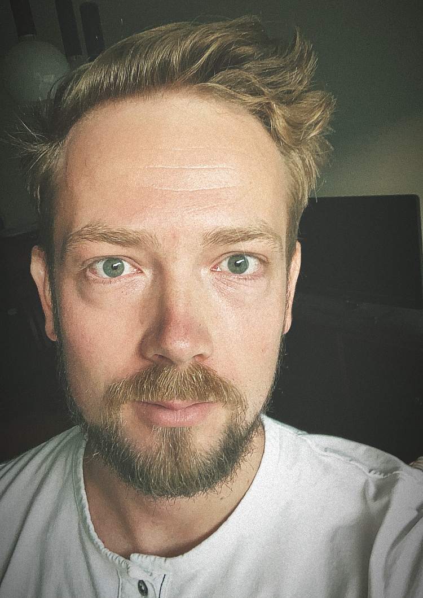

{ width=30% align=right }

# Mitja Jančič

I'm a **software developer** and **researcher** in the field of _numerical simulations_ at [FIFTY2 Technology](https://www.fifty2.eu/). In addition to my current role, I also work as a **self-employed software developer** with a strong passion for **computational science**.

[:fontawesome-solid-location-dot: Tolmin, Slovenia](https://maps.app.goo.gl/fM3M6eF7wWGsiNxt8)  
[:material-email: mitjajancic@gmail.com](mailto:mitjajancic@gmail.com)

!!! tip "Open to Collaborations"
    I'm excited to hear about new and challenging projects. Feel free to reach out!

## About Me

I hold a background in **physics** and **mechanical engineering** and have a deep interest in:

- **Numerical simulations**
- **High-performance computing (HPC)**
- **Software development** and
- **Computing technologies**

When I'm not working, I enjoy outdoor activities like **paragliding**, **hiking**, **cycling**, and **sailing**. These hobbies give me the work-life balance I need.