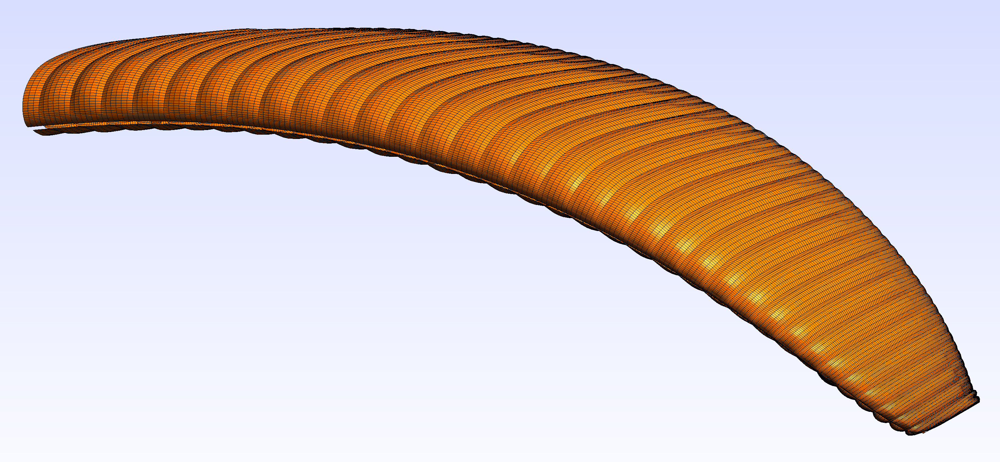
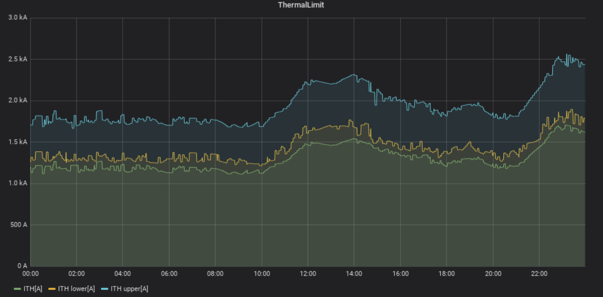
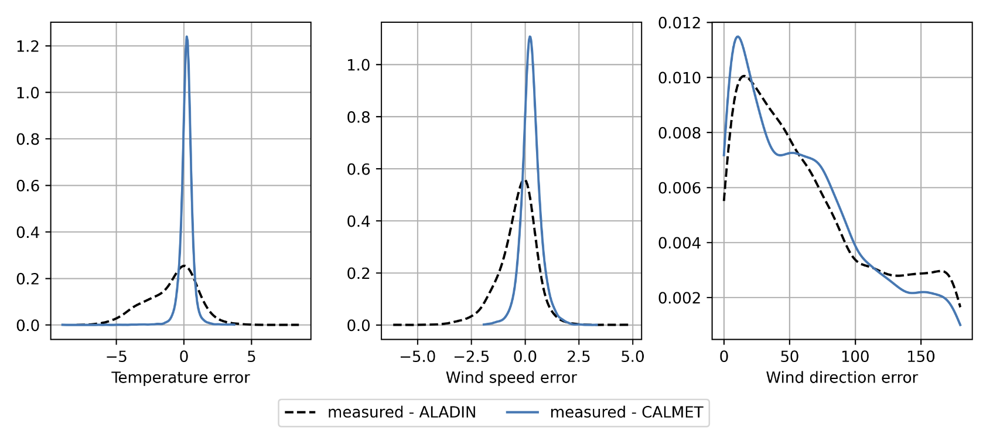
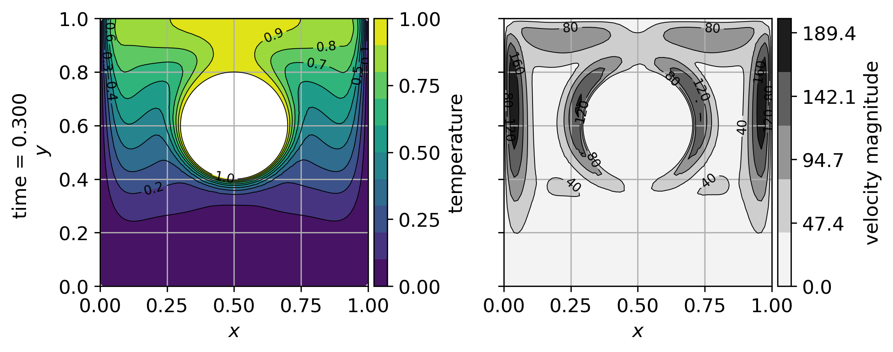

# Projects

## Ongoing

!!! info "WingDesigner++"
    WingDesigner++ is an advanced software tool for the design and simulation of paragliders. It allows users to input design parameters from a dedicated Excel file and outputs 3D models, production-ready DXF files, and simulation-related files (including automatic FEM mesh generation).

    It will also support fluid-solid interaction simulation using the smoothed particle hydrodynamics.

    <figure>
      { width=70%}
      <figcaption>Figure: Example of an FEM mesh for a paraglider.</figcaption>
    </figure>

!!! info "WingChecker Excel VSTO Add-In"
    [WingChecker](https://distractor.github.io/WingChecker_Documentation/) is a VSTO Excel Add-in written in C#.

    The add-in is designed to check the line lengths on paragliders, providing valuable insights for quality control and safety check.

    <figure>
      { width=70%}
      <figcaption>Figure: Screenshot of VSTO Add-In.</figcaption>
    </figure>

---

## Past

??? info "Uncertainty Module for Dynamic Thermal Rating (DTR)"
    High-voltage transmission lines are a crucial part of the electric power transmission network, connecting the production and consumption network in Slovenia and linking the Slovenian transmission system with neighboring ones. Recently, the rapid development of the electricity market and the inclusion of renewable energy resources have presented new challenges for system operators. They need to balance market demands, operational safety, and environmental impact while ensuring maximum transmission capacity.

    Dynamic Thermal Rating (DTR) systems, which monitor conductor temperatures and estimate future trends using weather and load forecasts, are a key tool in this process. However, DTR introduces questions about the accuracy and uncertainty of thermal assessments, as well as the acceptable level of risk. Our uncertainty module for DTR was developed to address these concerns, based on data from two transmission line locations in Slovenia: Podlog and Bevkov vrh.

    <figure>
      { width=70%}
      <figcaption>Figure: DTR uncertainty assessment showing calculated ampacity with lower and upper limits for the Obersielach-Podlog transmission line on July 12, 2020.</figcaption>
    </figure>

??? info "Trading Tools"
    We developed a **realtime** web-based trading tool that simulates different trading strategies. This tool allows users to test and refine trading approaches in dynamic environments, offering significant flexibility for market participants.

??? info "Downscaling Weather Data to Complex Terrain"
    This project focused on evaluating models used to downscale mesoscale meteorological data for complex terrain using diagnostic or prognostic models. The study was particularly focused on temperature, wind fields, and solar irradiation. The CALMET model was selected and implemented for performance analysis within a Python framework, offering significant improvements in predicting localized weather patterns.

    <figure>
      { width=70%}
      <figcaption>Figure: Error comparison of downscaled fields. Black line represents the mesoscopic model ALADIN, and the blue line represents the CALMET implementation.</figcaption>
    </figure>

??? info "Medusa: Coordinate-Free Meshless Method Implementation"
    [Medusa](http://e6.ijs.si/medusa/) is a C++ library for solving partial differential equations (PDEs) with an intuitive, coordinate-free syntax. This library supports a wide range of problems including linear elasticity, plastic deformation, fluid flow, heat transfer, and moving boundary problems. It also includes implementations of adaptive solution procedures and a comprehensive study of approximation methods.

    <figure>
      { width=70%}
      <figcaption>Figure: Natural convection from a heated cylinder.</figcaption>
    </figure>